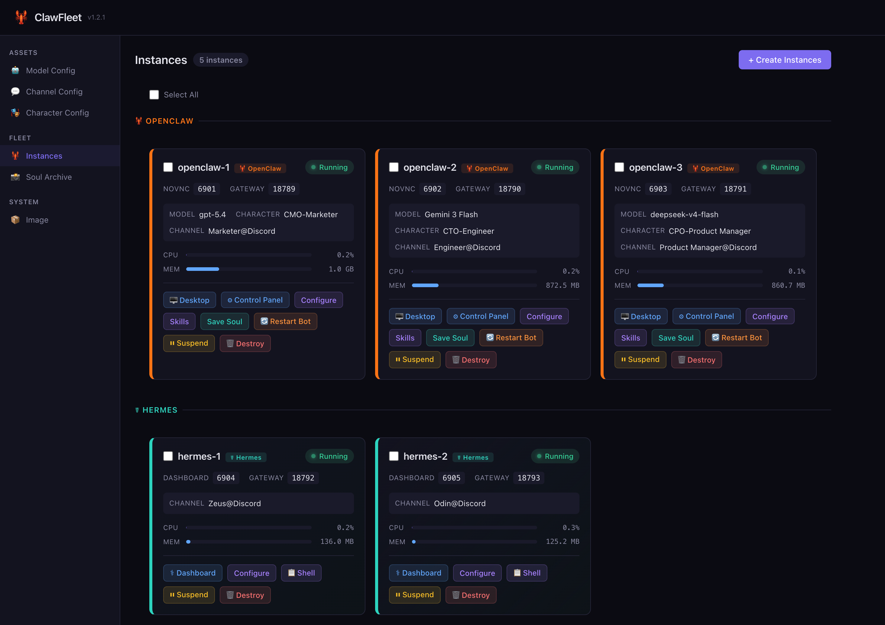
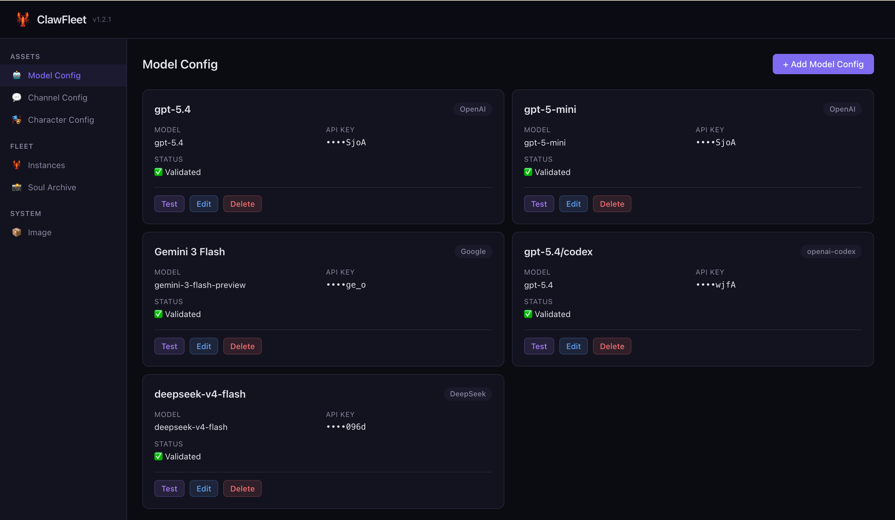
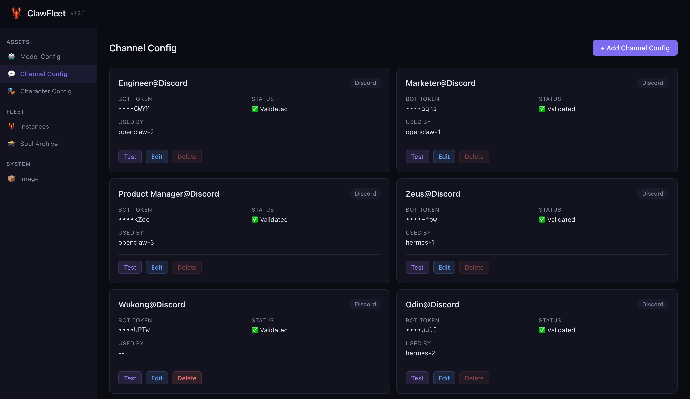
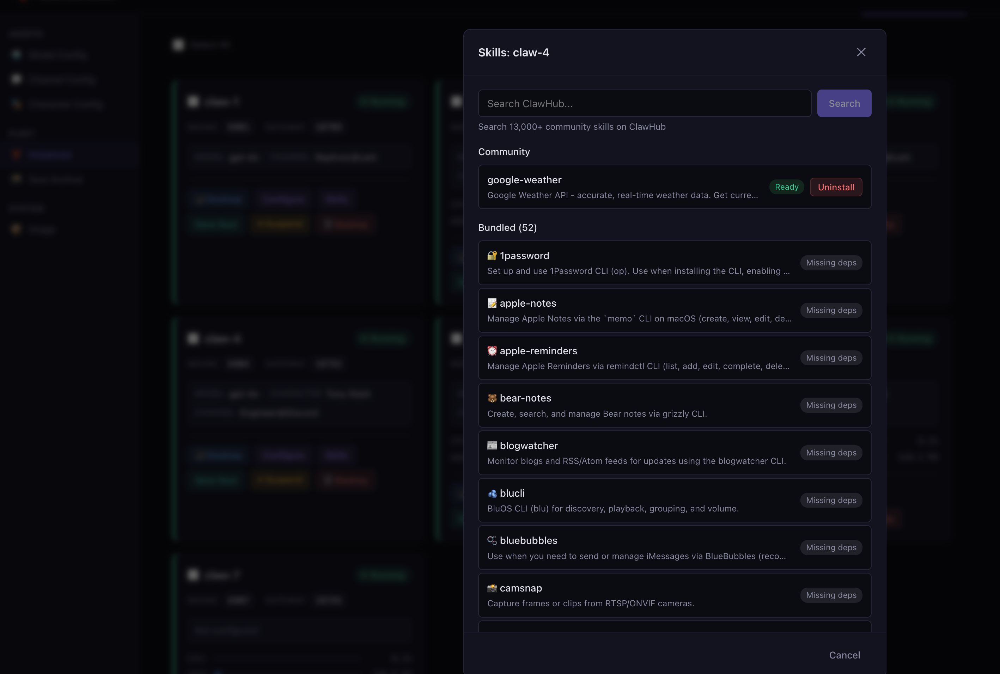
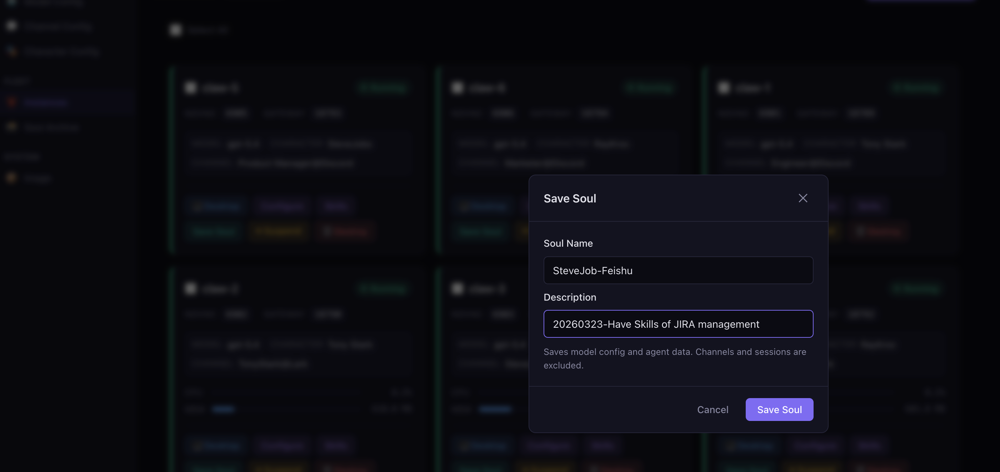
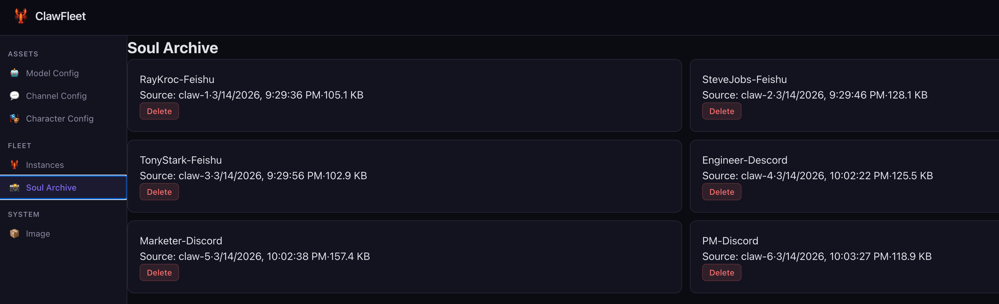
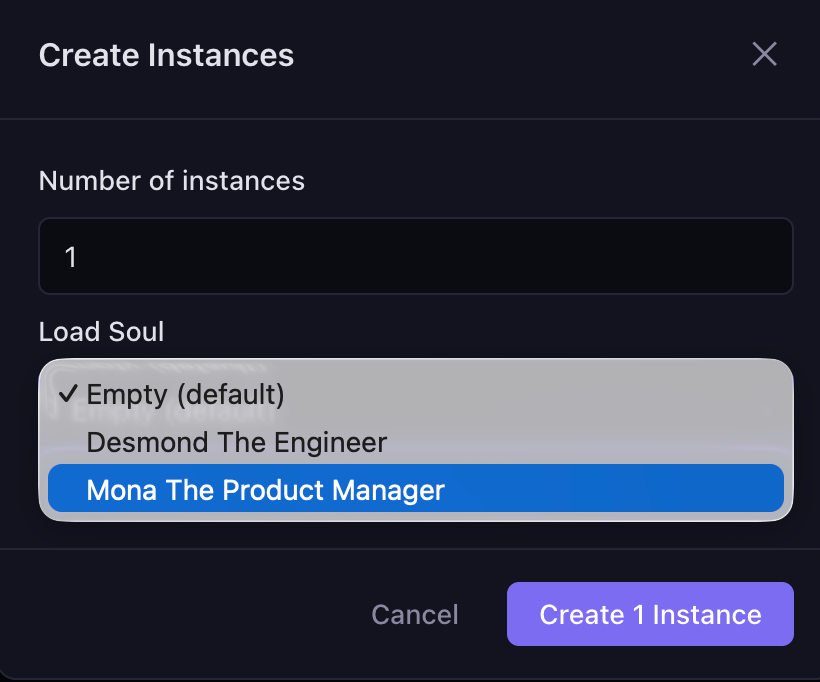
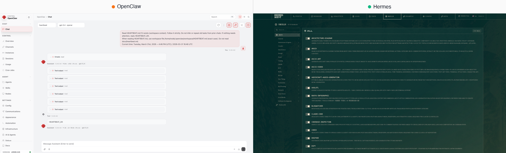

# ClawFleet

[](https://github.com/clawfleet/ClawFleet/releases)
[](https://github.com/clawfleet/ClawFleet/blob/main/LICENSE)
[](https://go.dev/)
[](https://www.docker.com/)
[](https://github.com/clawfleet/ClawFleet)
[](https://github.com/clawfleet/ClawFleet/wiki)

🌐 **官网:** [clawfleet.io](https://clawfleet.io) · 💬 **社区:** [Discord](https://discord.gg/b5ZSRyrqbt) · 📝 **博客:** [Dev.to](https://dev.to/weiyong1024/i-built-an-open-source-tool-to-run-ai-agents-on-my-laptop-they-collaborate-in-discord-managed-1c42)

> 5 分钟在你的笔记本上跑起一队 AI 智能体——OpenClaw 和 Hermes 各自跑在隔离的 Docker 容器里，从一个浏览器仪表盘统一管理。直接登录你的 ChatGPT 订阅，不付云账单。

[English](./README.md)

**想象你买了 N 台专用 Mac Mini**，每台跑一个 AI 智能体——有的是 OpenClaw、有的是 Hermes，全部在 Discord 里协作。一家属于你的 AI 公司——数据在你手里，不付订阅费。

**ClawFleet 让这件事免费。** 每个智能体跑在独立 Docker 容器中，文件系统和网络相互隔离。在你现有的 Mac 或 Linux 上运行。每个 OpenClaw 实例约 500 MB 内存，每个 Hermes 实例约 150 MB。



## 开始使用

```bash
curl -fsSL https://clawfleet.io/install.sh | sh
```

5 分钟：Docker 安装完成、镜像拉取完毕、Dashboard 在 `http://localhost:8080` 运行。一个 API Key 即可接入任意模型供应商——所有实例（OpenClaw 或 Hermes）都跑在独立 Docker 容器中，完全隔离。

[](https://youtu.be/jE5ZR8g477s)
[](https://youtu.be/jE5ZR8g477s)

---

## ClawFleet 能做什么

- **双 runtime、一个 Dashboard** — OpenClaw 和 Hermes，都是一等公民（[详情见下 ↓](#受支持的-runtime)）
- **沙箱隔离** — 每个智能体跑在独立 Docker 容器中，与宿主机和邻居完全隔离
- **任意 LLM 供应商** — OpenAI、Anthropic、Google、DeepSeek，或登录你的 ChatGPT 订阅 _(OpenClaw)_
- **`clawfleet shell`** — 一键进入任意实例的终端：Hermes TUI 对话或 OpenClaw bash
- **版本锁定** — 锁定经过测试的 runtime 版本，上游 breaking change 与你无关
- **人设系统** — 可复用的角色定义（简介、背景、风格、特质）_(OpenClaw)_
- **技能管理** — 52 个内置 + 13,000+ 个 ClawHub 社区技能 _(OpenClaw)_
- **灵魂存档** — 把人设 + 记忆 + 配置打包存档，一键克隆给新员工 _(OpenClaw)_

## 前置要求

- macOS 或 Linux
- **Mac 用户：** 强烈建议预先安装 [Docker Desktop](https://www.docker.com/products/docker-desktop/) 以获得最佳体验  
  <sub>否则 ClawFleet 会自动安装 Colima 作为替代容器运行时。</sub>

## 安装详情

上面的安装命令会：
1. 自动安装 Docker（macOS 用 Colima，Linux 用 Docker Engine）
2. 下载并安装 `clawfleet` 命令行工具
3. 拉取预构建沙箱镜像（约 1.4 GB）
4. 后台守护进程启动 Dashboard
5. 在浏览器中打开 http://localhost:8080

<details>
<summary><strong>Linux 服务器部署说明</strong></summary>

Linux 下 Dashboard 默认监听 `0.0.0.0:8080`。如需限制只允许本机：

```bash
clawfleet dashboard stop
clawfleet dashboard start --host 127.0.0.1
```

从本地通过 SSH 隧道访问：

```bash
ssh -fNL 8081:127.0.0.1:8080 user@your-server   # 然后访问 http://localhost:8081
```

**Control Panel**（OpenClaw 内置 Web UI）需要[安全上下文](https://developer.mozilla.org/zh-CN/docs/Web/Security/Secure_Contexts)——SSH 隧道可满足。Hermes 原生 Dashboard 无此要求。其他 Dashboard 功能无需隧道即可使用。

</details>

> **手动安装？** 参阅 [快速开始](https://github.com/clawfleet/ClawFleet/wiki/Getting-Started) wiki。

## 经营你的 AI 公司

把 ClawFleet 想象成**你的 AI 公司**。资产管理是公司的工具仓库；Fleet 是 AI 员工团队。把不同工具分配给不同员工，让你的 AI 团队投入生产。

### 备好工具库

**Assets → Models** — 注册 LLM API Key。员工用来「思考」的「大脑」。保存前自动验证。Models 在所有 runtime 之间共享。



**Assets → Characters** — 可复用的人设。把它当作「岗位说明书」—— 一个 CTO、一个 CPO、一个 CMO。简介、背景、沟通风格、性格特征。_Characters 目前只对 OpenClaw 实例生效；Hermes 用自己 native Dashboard 里的人设系统。_


**Assets → Channels** — 接入消息平台。员工服务客户的「工位」。保存前自动验证。_OpenClaw 支持 24+ 平台；Hermes 目前支持 Discord / Telegram / Slack。_



### 招聘与装备团队

**Fleet → Create** — 创建一个 OpenClaw 或 Hermes 实例。每一个都是加入公司的新员工。

**Fleet → Configure** — 为每个实例分配 model、character 和 channel。给 CTO 装上 Claude 大脑和 Discord 工位，给 CMO 装上 GPT 大脑和 Slack 工位。不同员工，不同工具，不同灵魂。


### 教会新技能

**Fleet → Skills** — 每个实例自带 52 个内置技能（天气、GitHub、编程等）。想要更多？在 [ClawHub](https://clawhub.com) 搜索 13,000+ 个社区技能，一键安装。不同员工可以学不同技能。_Skill Manager 目前是 OpenClaw 专属——Hermes 通过自己的 Dashboard 管理技能。_



### 保存与克隆员工的灵魂

当一个员工被训练得足够好，可以保存它的「灵魂」——人设、记忆、模型配置和对话历史——以便随时克隆。_灵魂存档目前是 OpenClaw 专属。_

**Fleet → Save Soul** — 点击任意已配置实例，将其灵魂保存到存档。



**Fleet → Soul Archive** — 浏览所有已保存的灵魂，随时可加载到新员工。



**Fleet → Create → Load Soul** — 创建新实例时，从存档中选一个灵魂。新员工继承原始员工的全部知识和人格。



### 观摩团队协作

把军团接入消息平台，观摩员工们自主协作。下图中，工程师、产品经理和市场专员在 Discord 群里欢迎新成员入职——全程自主运行。


## 受支持的 Runtime

ClawFleet 把所有 agent runtime 当作一等公民，统一在一个 Dashboard 里管理——共享 Asset 池（Models、Channels）、每实例容器隔离、实时统计、日志、事件流，以及 `clawfleet shell` 终端访问。

ClawFleet 当前发行版内置两个 runtime：**OpenClaw** 和 **Hermes**。OpenClaw 接入时间更长，目前在 Dashboard UI 中暴露的功能更完整。Hermes 接入较新，当前 Dashboard 范围是容器生命周期 + Configure（模型 + Channel），更深入的功能通过 Hermes 自己的原生 Dashboard 完成。两个 runtime 全 Dashboard 功能对等是 ClawFleet 正在推进的方向——也是未来接入更多 runtime 的范式。

### OpenClaw — 驻留在消息平台的智能体协作组

Upstream: [github.com/openclaw/openclaw](https://github.com/openclaw/openclaw)

OpenClaw 是一个本地优先的智能体网关，让一个 agent 可以从 24+ 消息平台被访问——Telegram、Discord、Slack、Lark、WhatsApp、Signal、Matrix 等等。Bot 作为参与者**入驻**会话，支持配对码、@提及、roster 感知的多 bot 协作。

适合在以下场景选 OpenClaw：
- 想要一个驻留在群聊里的 bot（不是需要单独 DM 召唤的助手）
- 想要一队不同人格在同一个 Discord 协作（CEO + CTO + PM）通过 roster 互相 @
- 想要从精选社区目录（ClawHub，13,000+）安装技能

ClawFleet 当前对 OpenClaw 提供：
- **Configure** — 从 Dashboard 一键配置 Model + Character + Channel
- **Characters** — 可复用人设，通过 SOUL.md 热加载
- **Skills** — 52 个内置 + ClawHub 社区技能在 Skill Manager 一键安装
- **Save Soul** — 把人设 + 配置打包存档，克隆给新员工

### Hermes — 单用户、自学习的智能体

Upstream: [github.com/NousResearch/hermes-agent](https://github.com/NousResearch/hermes-agent)

Hermes 围绕一个学习闭环构建：智能体从经验中**写出新技能**、在使用中持续改进，并通过跨会话记忆（FTS5 全文检索 + Honcho 用户建模）让记忆持续累积。主交互界面是 TUI，消息平台是次要的远程触发面。

适合在以下场景选 Hermes：
- 想要一个**会越用越懂你**的私人 agent（不是群聊参与者，而是「我的助理」）
- 需要一等公民的 cron / 计划任务，结果递达消息平台
- 想让智能体在 SSH / Daytona / Modal（serverless）等远程后端执行任务
- 想接入长尾 LLM 供应商（Nous Portal、GLM、Kimi、MiMo、MiniMax、OpenRouter 200+）
- 偏好 TUI 优先的工作流

ClawFleet 当前对 Hermes 提供：
- **Configure** — 从 Dashboard 用同一个 Asset 池配置 Model + Channel（Discord / Telegram / Slack）
- **Hermes Dashboard** — 一键打开 Hermes 原生 Dashboard，访问 credential pool、cron、人设、终端后端等深度功能
- **`clawfleet shell hermes-1`** — 直接进入 Hermes 交互式 TUI



此外，ClawFleet 还通过 noVNC 把实例容器内的图形桌面暴露到浏览器——方便观察 agent 正在做什么、手动接管工作流、或演示。当前在 OpenClaw 镜像上可用（OpenClaw 镜像内置 XFCE 桌面）；为 Hermes 提供同等可视化能力是 ClawFleet 正在推进的方向。


## 文档

完整文档请参阅 **[Wiki](https://github.com/clawfleet/ClawFleet/wiki)**：
- [快速开始](https://github.com/clawfleet/ClawFleet/wiki/Getting-Started) — 前置要求、安装、第一个实例
- [Dashboard 指南](https://github.com/clawfleet/ClawFleet/wiki/Dashboard-Guide) — 侧栏、资产管理、实例管理
- LLM 供应商指南 — [Anthropic](https://github.com/clawfleet/ClawFleet/wiki/Provider-Anthropic) | [OpenAI](https://github.com/clawfleet/ClawFleet/wiki/Provider-OpenAI) | [Google](https://github.com/clawfleet/ClawFleet/wiki/Provider-Google) | [DeepSeek](https://github.com/clawfleet/ClawFleet/wiki/Provider-DeepSeek)
- 频道指南 — [Telegram](https://github.com/clawfleet/ClawFleet/wiki/Channel-Telegram) | [Discord](https://github.com/clawfleet/ClawFleet/wiki/Channel-Discord) | [Slack](https://github.com/clawfleet/ClawFleet/wiki/Channel-Slack) | [Lark](https://github.com/clawfleet/ClawFleet/wiki/Channel-Lark)
- [CLI 参考](https://github.com/clawfleet/ClawFleet/wiki/CLI-Reference) | [常见问题](https://github.com/clawfleet/ClawFleet/wiki/FAQ)

## CLI 命令

任何命令都支持 `--help`：

```bash
clawfleet --help              # 所有命令
clawfleet dashboard --help    # Dashboard 子命令组
```

常用命令速查：

```bash
clawfleet create <N> [--runtime openclaw|hermes]   # 创建 N 个实例（默认：openclaw）
clawfleet create <N> --pull                         # 强制从 registry 重新拉取镜像
clawfleet create 1 --from-snapshot <soul>           # 从灵魂存档克隆（OpenClaw）
clawfleet configure <name>                          # 配置 model + channel（OpenClaw 走 CLI；Hermes 走 Dashboard）
clawfleet list                                      # 列出所有实例及状态
clawfleet shell <name>                              # 进入实例终端：Hermes TUI / OpenClaw bash
clawfleet desktop <name>                            # 打开 noVNC 桌面（OpenClaw）
clawfleet start|stop|restart <name|all>             # 生命周期控制
clawfleet logs <name> [-f]                          # 查看日志
clawfleet destroy <name|all> [--purge]              # 销毁（--purge 同时删除数据）
clawfleet snapshot save|list|delete <name>          # 灵魂存档（OpenClaw）
clawfleet dashboard serve|stop|restart|open         # Dashboard daemon
clawfleet build                                     # 本地构建镜像
clawfleet config | version                          # 配置 / 版本信息
```

## 重置

销毁所有实例（含数据）、停止 Dashboard、清除构建产物：

```bash
make reset
```

## 资源占用参考

空闲内存，测试环境：M4 MacBook Air（16 GB 内存）

| 实例数 | OpenClaw 内存 | Hermes 内存 |
|--------|--------------|------------|
| 1      | ~700 MB      | ~140 MB    |
| 3      | ~2.1 GB      | ~400 MB    |
| 5      | ~3.5 GB      | ~700 MB    |

<sub>OpenClaw 在 agent 主动浏览（加载 Chromium）时内存翻 ~3 倍。Hermes 基本保持稳定。</sub>

## License

MIT · 欢迎提交 Issue 或 PR 参与贡献。使用中遇到问题：weiyong1024@gmail.com
